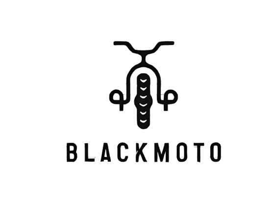

# BlackMoto

<center>

</center>

## Índice
1. [Descripción General](#descripción-general)
2. [Funcionalidades](#funcionalidades)
3. [Requisitos Técnicos](#requisitos-técnicos)
4. [Instalación y Configuración](#instalación-y-configuración)
5. [Pruebas y Cobertura](#pruebas-y-cobertura)
6. [Integración Continua](#integración-continua)
7. [Especificaciones Técnicas](#especificaciones-técnicas)

## Descripción General
BlackMoto es una aplicación desarrollada en Flutter que implementa Clean Architecture y ue permite a los usuarios ahorrar tanto su tiempo como su dinero en la búsqueda de los servicios especificos para su motocicleta.

## Funcionalidades

### Para Usuarios
- Registro de usuarios
- Creación de perfil para motos
- Búsqueda de servicios específicos para vehículos
- Visualización de información de establecimientos
- Calificación de servicios
- Publicación de reseñas

### Para Establecimientos
- Registro de establecimiento
- Gestión de servicios (agregar/quitar)
- Publicación de ofertas de servicios

## Requisitos Técnicos
- Flutter 3.27.1
- Dart 3.6.0

## Instalación y Configuración

### 1. Clonar el Repositorio
```bash
git clone https://github.com/EstebanGitPro/Black_Moto.git
cd Black_Moto
```

### 2. Instalar Dependencias
```bash
dart pub get
```

### 3. Ejecutar la Aplicación
```bash
flutter run
```

## Pruebas y Cobertura

### Configuración de Pruebas
1. Instalar LCOV
```bash
brew install lcov
```

2. Generar Datos de Cobertura
```bash
flutter test --coverage
```

3. Generar Reportes HTML
```bash
genhtml coverage/lcov.info -o coverage/html
```

4. Visualizar Reportes
```bash
open coverage/html/index.html
```

## Integración Continua

### Configuración Local
#### Pre-commit
- Análisis estático de código
- Ejecución de pruebas unitarias

#### Commit-msg
- Validación de estructura de mensajes de commit

#### Pre-push
- Validación de cobertura de código

### GitHub Actions
El workflow (.github/workflows/build.yml) incluye:
1. Validación de código
2. Pruebas unitarias con cobertura
3. Generación de APK
4. Almacenamiento del APK como artefacto

Para acceder a los builds:
1. Ir a "Actions" en GitHub
2. Seleccionar el último workflow
3. Descargar el APK desde "Artifacts"

## Especificaciones Técnicas
- Android SDK Build-Tools: 33.0.1
- Tamaño del APK: 18.3MB
- Ubicación del APK: build/app/outputs/flutter-apk/app-release.apk
- Flutter embedding: v2 (actualizado desde v1)
