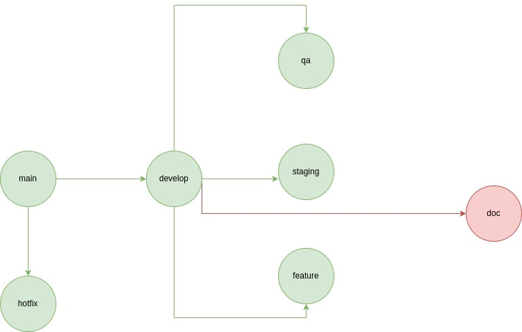

# Guía de Ramas del Proyecto
Este documento describe las convenciones y prácticas recomendadas para el manejo de ramas en este proyecto.

## Índice
1. [Tipos de Ramas](#tipos-de-ramas)
   - [Feature Branches](#1-feature-branches)
   - [Hotfix Branches](#2-hotfix-branches)
   - [Bugfix Branches](#3-bugfix-branches)
2. [Diagrama de Ramas](#diagrama-de-ramas)
3. [Reglas Generales](#reglas-generales)

## Tipos de Ramas

### 1. Feature Branches
- **Descripción**: Ramas utilizadas para desarrollar nuevas características.
- **Convención de Nombres**: `feature/nombre-de-la-caracteristica`
- **Ejemplo**: `feature/login-form`
- **Proceso**:
  - Crear la rama desde `develop`.
  - Realizar cambios y hacer commit.
  - Abrir un Pull Request hacia `develop`.

### 2. Hotfix Branches
- **Descripción**: Ramas utilizadas para corregir errores críticos en producción.
- **Convención de Nombres**: `hotfix/nombre-del-hotfix`
- **Ejemplo**: `hotfix/fix-login-bug`
- **Proceso**:
  - Crear la rama desde `main`.
  - Realizar cambios y hacer commit.
  - Abrir un Pull Request hacia `main` y `develop`.

### 3. Bugfix Branches
- **Descripción**: Ramas utilizadas para corregir errores no críticos.
- **Convención de Nombres**: `bugfix/nombre-del-bugfix`
- **Ejemplo**: `bugfix/fix-ui-bug`
- **Proceso**:
  - Crear la rama desde `develop`.
  - Realizar cambios y hacer commit.
  - Abrir un Pull Request hacia `develop`.

## Diagrama de Ramas

## Reglas Generales
- Todos los Pull Requests deben tener al menos un revisor.
- Las ramas `main`, `develop`, y `qa` están protegidas y no se pueden modificar directamente.
